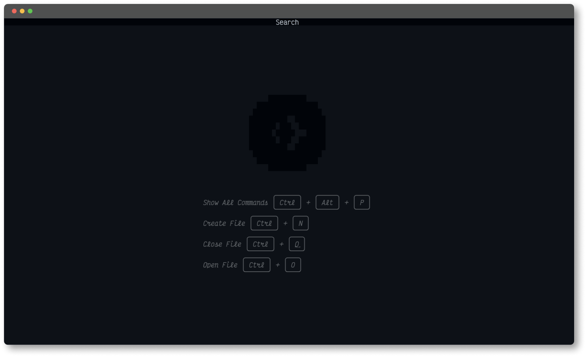

# Code

## The Repository

This is a study project. The Project present to text editor with console based user interface and. This source code is available for everyone.

## Code



### Features

* Support two color themes
* Load file
* Save file
* Editing file
* Ability to open multiple files

## Quick start

Before build or run programs need to download dotnet 8.0 Runtime.

### Build

```powershell
git clone https://github.com/ReZerVV/Code.git
cd Code
dotnet build
```

### Run

```powershell
git clone https://github.com/ReZerVV/Code.git
cd Code
dotnet run --project .\Word\
```